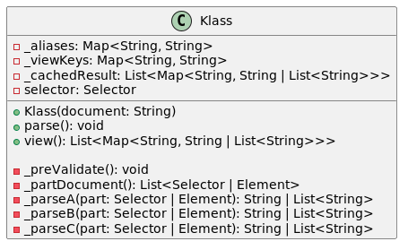

# Selector schema codegen
[RUSSIAN](README_RU.md) [ENGLISH](README.md)

ssc_codegen - generator of parsers for various programming languages (for html priority) using
yaml-DSL configurations with built-in declarative language.

Designed to port parsers to various programming languages

## Minimum requirements for the target portable language:
- include regular expressions
- include css/xpath libs for more supports queries (nth-child, ...)
- basic methods for works with strings (format string, trim/left trim/right trim/split/replace)

## Recommendations
- usage css selector: they can be **guaranteed** converted to xpath
- there is an xpath to css converter for simple queries **without guarantees of functionality**. 
For example, in css there is no analogue of `contains` from xpath, etc.
## Schematic representation of generator operation


## Syntax specs

### Language features

- DSL (Domain-Specific Language), declarative (no assignment, arithmetic, priority operations)
- Minimalistic syntax for working with selectors, regular expressions and simple string operations
- All methods take **one** argument as input and it is always selector-like type
- 4 types
- Regular expression syntax is like in python. For maximum compatibility, use for example `[0-9]` instead of `\d`
- Empty lines and comments (`//`) are ignored by the parser.

### Types description
There are 4 data types for this scripting language

| Тип            | Описание                                                                                                |
|----------------|---------------------------------------------------------------------------------------------------------|
| SELECTOR       | class instance (Document, Element) from which css/xpath selectors are called. Always the first argument |
| SELECTOR_ARRAY | representation of a list of nodes of all found elements from the SELECTOR instance                      |
| TEXT           | string                                                                                                  |
| ARRAY          | array of strings                                                                                        |


### Description of directives
- statements are separated by line indentation `\n`
- All string arguments are specified with **double** `"` quotes.
- Space are ignored

| Operator | Arguments                 | Description                                                                                                                                  | Return type value | Example                    |
|----------|---------------------------|----------------------------------------------------------------------------------------------------------------------------------------------|-------------------|----------------------------|
| default  | "<value>"                 | Default value if an error occurred during parsing. **Listed first**                                                                          | -                 | default "empty"            |
| xpath    | "<expr>"                  | xpath selector, returns the first value found                                                                                                | SELECTOR          | xpath "//title"            |
| xpathAll | "<expr>"                  | xpath selector, returns all values                                                                                                           | SELECTOR          | xpathAll "//div"           |
| css      | "<expr>"                  | css selector, returns the first value found                                                                                                  | SELECTOR          | css "title"                |
| cssAll   | "<expr>"                  | css selector, returns all values                                                                                                             | SELECTOR          | cssAll "div > a"           |
| attr     | "<tag attr>"              | get tag(s). Called after xpath/xpathAll/css/cssAll                                                                                           | TEXT/ARRAY        | attr "href"                |
| text     |                           | get the text inside the tag. Called after xpath/xpathAll/css/cssAll. Can be called first to completely convert a `SELECTOR` object to `TEXT` | TEXT/ARRAY        | text                       |
| raw      |                           | get the raw tag as text. Called after xpath/xpathAll/css/cssAll                                                                              | TEXT/ARRAY        | raw                        |
| re       | "<exrp>"                  | regular expression. Returns the first element found. Argument must be TEXT                                                                   | TEXT              | re "(\d+)"                 |
| reAll    | "<expr>"                  | regular expression. Returns all found elements. Argument must be TEXT                                                                        | ARRAY             | reAll "(\d+)"              |
| reSub    | "<expr>" "<repl>" <count> | Replacement by regular expression. Argument must be TEXT                                                                                     | TEXT              | reSub "(\d+)" "digit(lol)" |
| strip    | "<string>"                | Removes the given string LEFT and RIGHT. Argument must be TEXT                                                                               | TEXT              | strip "\n"                 |
| lstrip   | "<string>"                | Deletes the specified line from the LEFT. Argument must be TEXT                                                                              | TEXT              | lstrip " "                 |
| rstrip   | "<string>"                | Deletes the specified row on the RIGHT. Argument must be TEXT                                                                                | TEXT              | rstrip " "                 |
| format   | "<string>"                | Format string. Specify a substitution argument using the `{{}}` operator. Argument must be TEXT                                              | TEXT              | format "spam {{}} egg"     |
| split    | "<value>" <count>         | Splitting a line. If count = -1 or not transmitted, divide by the maximum available. Argument must be TEXT                                   | ARRAY             | split ", "                 |
| replace  | "<old>" "<old>" <count>   | String replacement. If count = -1 or not passed, replace it with the maximum available one. Argument must be TEXT                            | ARRAY             | split ", "                 |
| limit    | <count>                   | Maximum number of elements                                                                                                                   | ARRAY             | limit 50                   |
| index    | <index>                   | Take element by index. Argument must be ARRAY                                                                                                | TEXT              | index 1                    |
| first    |                           | `index 1` alias                                                                                                                              | TEXT              | first                      |
| last     |                           | `index -1` alias                                                                                                                             | TEXT              | last                       |
| join     | "<string>"                | Collects ARRAY into a string. Argument must be ARRAY                                                                                         | TEXT              | join ", "                  |
| ret      |                           | Tell the translator to return a value. Automatically added if not specified in the script                                                    |                   | ret                        |
| noRet    | "<string>"                | Tell the translator not to return anything. Added for document pre-validation                                                                |                   | noRet                      |
| //       | ...                       | One line comment. Ignored by the final code generator                                                                                        |                   | // this is comment line    |


### Токены валидации

The following commands are needed to pre-validate the input document using `assert` and they **do not change**
final and intermediate values.

In this DSL language there are no `boolean`, `null` types, so if the result is false it will throw an error
like `AssertionError`.

The operators accept `SELECTOR`:
- assertCss
- assertXpath


All other operators accept `TEXT`:

| Оператор       | Описание                                                                        | Пример                          |
|----------------|---------------------------------------------------------------------------------|---------------------------------|
| assertEqual    | Full string comparison (`==`) (case sensitive)                                  | assertEqual "lorem upsum dolor" |
| assertContains | Comparison by presence of part of a string in `TEXT`                            | assertContains "sum"            |
| assertStarts   | Comparison based on the presence of part of a string at the beginning of `TEXT` | assertStarts "lorem"            |
| assertEnds     | Comparison based on the presence of part of a string at the end of `TEXT`       | assertEnds "dolor"              |
| assertMatch    | Compare `TEXT` by regular expression                                            | assertMatch "lorem \w+ dolor"   |
| assertCss      | Checking the validity of the query in `SELECTOR`.                               | assertCss "head > title"        |
| assertXpath    | Checking the validity of the query in `SELECTOR`.                               | assertXpath "//head/title"      |


### Example code generation

```
// set default value if parse process is failing
xpath "//title"
text
format "Cool title: {{}}"
```

generated python equivalent code:

```python
from parsel import Selector


def dummy_parse(part: Selector):
    val_0 = part.xpath('//title')
    val_1 = val_0.xpath('/text()').get()
    val_2 = "Cool title: {}".format(val_1)
    return val_2
```

generated dart equivalent code:

```dart
import 'package:html/parser.dart' as html;

dummy_parse(part){
    var val_0 = part.querySelector('title');
    String val_1 = val_0?.text ?? "";
    var val_2 = "Cool title: $val_1";
    return val_2;
}
```
add default value:

```
// set default value if parse process is failing
default "spam egg"
xpath "//title"
text
format "Cool title: {{}}"
```

```python
from parsel import Selector


def dummy_parse(part: Selector):
    try:  
      val_1 = part.xpath('//title')
      val_2 = val_1.xpath('/text()').get()
      val_3 = "Cool title: {}".format(val_2)
      return val_3
    except Exception:
        return "spam egg"
```

```dart
import 'package:html/parser.dart' as html;

dummy_parse(html.Document part){
  try{
    var val_0 = part.querySelector('title');
    String val_1 = val_0?.text ?? "";
    var val_2 = "Cool title: $val_1";
    return val_2;
  } catch (e){
    return "spam egg";
  }
    
}
```
add assert validator

```
// not null check operation
assertCss "head > title"
xpath "//title"
text
format "Cool title: {{}}"
```


```python
from parsel import Selector


def dummy_parse(part: Selector):
    assert part.css("head > title")
    val_1 = part.xpath('//title')
    val_2 = val_1.xpath('/text()').get()
    val_3 = "Cool title: {}".format(val_2)
    return val_3
```

```dart
import 'package:html/parser.dart' as html;

dummy_parse(html.Document part){
    assert(part.querySelector('title') != null);
    var val_0 = part.querySelector('title');
    String val_1 = val_0?.text ?? "";
    var val_2 = "Cool title: $val_1";
    return val_2;
}
```

## yaml config
An example of the structure of the generated parser class:


- selector - Selector/Document instance, initialized using document
- _aliases - remapping keys for the view() method
- _viewKeys - output keys for the view() method
- _cachedResult - cache of obtained values from the parse() method
- parse() - launching the parser
- view() - getting the received values
- _preValidate() - an optional method of preliminary validation of the input document according to the rules from the configuration. If the result is false/null, it throws `AssertError`
- _partDocument() - an optional method of dividing a document into parts using a given selector. Useful, for example, for obtaining elements of the same type (product cards, etc.)
- _parseA, _parseB, _parseC, ... - automatically generated parser methods for each key (A,B,C) according to the rules from the configuration

### Usage pseudocode example:
```
document = ... // extracted html document
instance = Klass(document)
instance.parse()
print(instance.view())
```

Example configuration file, see in [examples](examples)

## dev 
[DEV](README_DEV.md)


## TODO
- generated schemas checksum
- filter operations (?)
- constants support
- more languages, libs support
- codegen optimizations (usage SELECTOR fluent interfaces, one-line code generation)
- css/xpath analyzer in pre-generate step
- css/xpath patches (for example, if css selectors in target language not support `:nth-child` operation?)
- translate regex expressions. Eg: `\d` to `[0-9]`
- string methods: `title`, `upper`, `lower`, `capitalize` or any useful
