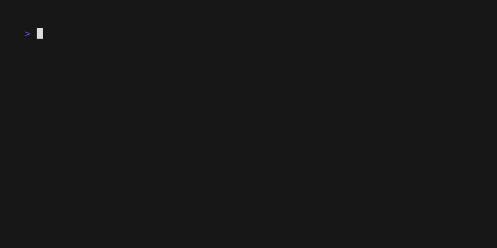
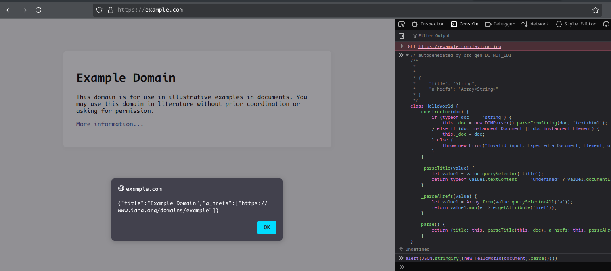

# Selector Schema codegen

## Introduction

ssc-gen - based-python DSL language for writing html parsers in dataclass style for translating to targeting language.

Project solving next problems:

- decrease boilerplate code
- create types (or type annotations if possible) and documentation 
- simplify code support
- portability to other languages

## Support converters

Current support converters

| Language      | Library (html parser backend) | XPath Support | CSS Support | Generated types                          | Code formatter |
|---------------|-------------------------------|---------------|-------------|------------------------------------------|----------------|
| Python (3.8+) | bs4                           | N             | Y           | TypedDict*, list, dict                   | ruff           |
| ...           | parsel                        | Y             | Y           | ...                                      | -              |
| ...           | selectolax (lexbor)           | N             | Y           | ...                                      | -              |
| js (ES6)      | pure (firefox/chrome/nodejs)  | Y             | Y           | Array, Map**                             | -              |
| go (1.10+)    | goquery                       | N             | Y           | struct(json anchors include), array, map | gofmt          |

- *this annotation type was deliberately chosen as a compromise reasons. 
Python has many ways of serialization: `namedtuple, dataclass, attrs, pydantic, msgspec, etc`
  - TypedDict is like a build-in dict, but with IDE and linter hint support, and you can easily implement an adapter for the required structure.
- **js exclude build-in serialization methods

### Limitations

For maximum portability of the configuration to the target language:

- Use CSS selectors: they are guaranteed to be converted to XPATH
- Unlike javascript, most html parse libs implement [CSS3 selectors standard](https://www.w3.org/TR/selectors-3/).
check in target lib complex selectors before implement:
  - basic selectors: (`tag`, `.class`, `#id`, `tag1,tag2`)
  - combined: (`div p`, `ul > li`, `h2 +p`, `title ~head`\[1])
  - attribute: (`a[href]`, `input[type='text']`)\[2]
  - pseudo classes: (`:nth-child(n)`, `:first-child`, `:last-child`)\[3]
  - **often, not support more complex, dynamic styles**: (`:has()`, `:nth-of-type()`, `:where()`, `:is()`)

1. Several libs not support `+` operations (eg: [selectolax(modest)](https://github.com/rushter/selectolax), [dart.universal_html](https://pub.dev/packages/universal_html))
2. Often, web scraping libs not supports attribute operations like `*=`, `~=`, `|=`, `^=` and `$=`
3. Several libs not support pseudo classes (eg: standard [dart.html](https://dart.dev/libraries/dart-html) lib miss this feature). 
This project will not implement converters with such a cons

## Getting started

ssc_gen required python 3.10 version or higher

### Install

pip:

```shell
pip install ssc_codegen
```

uv:

```shell
uv pip install ssc_codegen
```

as cli converter tool:

| package manager | command                       |
|-----------------|-------------------------------|
| pipx            | `pipx install ssc_codegen`    |
| uv              | `uv tool install ssc_codegen` |

## Example

### Create a file `schema.py` with:

```python
from ssc_codegen import ItemSchema, D

class HelloWorld(ItemSchema):
    title = D().css('title').text()
    a_hrefs = D().css_all('a').attr('href')
```

### try it in cli

>[!note]
> this tools developed for testing purposes, not for web-scraping

### from file

>[!warning]
> DO NOT PASS CONFIGS FROM UNKNOWN SOURCES: 
> 
> PYTHON CODE FROM CONFIGS COMPILE IN RUNTIME WOUT SECURITY CHECKS!!!

Download any html file and pass as argument:

```shell
ssc-gen parse-from-file index.html -t schema.py:HelloWorld  
```

Short options descriptions:

- `-t --target` - config schema file and class from where to start the parser



### from url

```shell
ssc-gen parse-from-url https://example.com -t schema.py:HelloWorld  
```


### from Chromium browser (CDP protocol)


```shell
ssc-gen parse-from-chrome https://example.com -t schema.py:HelloWorld
```

>[!note]
> if script cannot found chrome executable - provide it manually:

```shell
ssc-gen parse-from-chrome https://example.com -t schema.py:HelloWorld -sc /usr/bin/chromium
```


### Convert to code

Convert to code for use in projects:

>![note]
> for example, used js: it can be fast test in developer console


```shell
ssc-gen js schema.py -o .
```

Code output looks like this (code formatted by IDE):

```javascript
// autogenerated by ssc-gen DO NOT_EDIT
/***
 *
 * {
 *     "title": "String",
 *     "a_hrefs": "Array<String>"
 * }*/
class HelloWorld {

    constructor(doc) {
        if (typeof doc === 'string') {
            this._doc = new DOMParser().parseFromString(doc, 'text/html');
        } else if (doc instanceof Document || doc instanceof Element) {
            this._doc = doc;
        } else {
            throw new Error("Invalid input: Expected a Document, Element, or string");
        }
    }

    _parseTitle(v) {
        let v0 = v.querySelector('title');
        return typeof v0.textContent === "undefined" ? v0.documentElement.textContent : v0.textContent;
    }

    _parseAHrefs(v) {
        let v0 = Array.from(v.querySelectorAll('a'));
        return v0.map(e => e.getAttribute('href'));
    }

    parse() {
        return {
            title: this._parseTitle(this._doc),
            a_hrefs: this._parseAHrefs(this._doc),
        };
    }
}
```

### copy code output and past to developer console:

Print output:

```javascript
alert(JSON.stringify((new HelloWorld(document).parse())))
```




You can use any html source:

- read from html file
- get from http request
- get from browser (playwright, selenium, chrome-cdp)
- paste code to developer console (js)
- or call curl in shell and parse stdin
- use in third-party tools in stdin pipeline: 
(from [ProjectDiscovery](https://github.com/projectdiscovery), for example)


## See also
- [Brief](docs/brief.md) about css selectors and regular expressions.
- [Tutorial](docs/tutorial.md) how to use ssc-gen
- [Reference](docs/reference.md) about high-level API
- [AST reference](docs/ast_reference.md) about generation code from AST