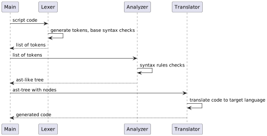

# Selector schema codegen

Парсер yaml-DSL конфигурации со встроенным декларативным языком-спецификацией
для генерации схем парсеров (преимущественно под html) на различные языки программирования.

Разработан для портирования парсеров на разные языки программирования


## Минимальные требования к целевому портируемому ЯП:
- есть регулярные выражения
- есть css/xpath библиотека
- базовые методы работы со строками (format string, trim/left trim/right trim/split/replace)

## Рекомендации
- использовать css селекторы: их можно **гарантированно** конвертировать в xpath. 
Это может пригодиться, например, если отсутствует поддержка xpath
- есть конвертер xpath в css простых запросов **без гарантий работоспособности**. 
Например, в css нет аналога `contains` из xpath и тд
## Схематичное представление работы генератора



## Спецификация синтаксиса

### Особенности языка

- DSL (Domain-Specific Language), Декларативный (отсутствуют операции присвоения, арифметики, приоритетов)
- Минималистичный синтаксис, для работы с селекторами, регулярными выражениями и простыми операциями со строками
- Принимает на вход **один** аргумент и он всегда selector-like типа
- 4 типа данных
- Синтаксис регулярных выражений как в python. Для максимальной совместимости используйте, например, `[0-9]` вместо `\d`
- Пустые строки и комментарии (`//`) игнорируются анализатором.

### Описание типов
Для данного скриптового языка существуют 4 типа данных

| Тип            | Описание                                                                           |
|----------------|------------------------------------------------------------------------------------|
| SELECTOR       | инстанс класса, из которого вызываются css/xpath селекторы. Всегда первый аргумент |
| SELECTOR_ARRAY | репрезентация списка узлов всех найденных элементов из инстанса SELECTOR           |
| TEXT           | строка                                                                             |
| ARRAY          | список строк.                                                                      |


### Описание директив
| Оператор | Аргументы                 | Описание                                                                                                                                          | Возвращаемое значение | Пример                     |
|----------|---------------------------|---------------------------------------------------------------------------------------------------------------------------------------------------|-----------------------|----------------------------|
| default  | <value>                   | Значение по умолчанию, если произошла ошибка во время парсинга. **Указывается первым**                                                            | -                     | default "empty"            |
| xpath    | "<expr>"                  | xpath селектор, возвращает первое найденное значение                                                                                              | SELECTOR              | xpath "//title"            |
| xpathAll | "<expr>"                  | xpath селектор, возвращает все значения                                                                                                           | SELECTOR              | xpathAll "//div"           |
| css      | "<expr>"                  | css селектор, возвращает первое найденное значение                                                                                                | SELECTOR              | css "title"                |
| cssAll   | "<expr>"                  | css селектор, возвращает все значения                                                                                                             | SELECTOR              | cssAll "div > a"           |
| attr     | "<tag attr>"              | получить тег(и). Вызывается после xpath/xpathAll/css/cssAll                                                                                       | TEXT/ARRAY            | attr "href"                |
| text     |                           | получить текст внутри тега. Вызывается после xpath/xpathAll/css/cssAll. Может быть вызван первым для полного перевода объекта `SELECTOR` в `TEXT` | TEXT/ARRAY            | text                       |
| raw      |                           | получить сырой тег в виде текста. Вызывается после xpath/xpathAll/css/cssAll                                                                      | TEXT/ARRAY            | raw                        |
| re       | "<exrp>"                  | регулярное выражение. Возвращает первый найденный элемент. Аргумент должен быть TEXT                                                              | TEXT                  | re "(\d+)"                 |
| reAll    | "<expr>"                  | регулярное выражение. Возвращает все найденные элементы. Аргумент должен быть TEXT                                                                | ARRAY                 | reAll "(\d+)"              |
| reSub    | "<expr>" "<repl>" <count> | Замена по регулярному выражение. Аргумент должен быть TEXT                                                                                        | TEXT                  | reSub "(\d+)" "digit(lol)" |
| strip    | "<string>"                | Удаляет заданную строку СЛЕВА и СПРАВА. Аргумент должен быть TEXT                                                                                 | TEXT                  | strip "\n"                 |
| lstrip   | "<string>"                | Удаляет заданную строку СЛЕВА. Аргумент должен быть TEXT                                                                                          | TEXT                  | lstrip " "                 |
| rstrip   | "<string>"                | Удаляет заданную строку СПРАВА. Аргумент должен быть TEXT                                                                                         | TEXT                  | rstrip " "                 |
| format   | "<string>"                | Format string. Аргумент подстановки указывать с помощью `{{}}` оператора. Аргумент должен быть TEXT                                               | TEXT                  | format "spam {{}} egg"     |
| split    | "<value>" <count>         | Разделение строки. Если count = -1 или не передан - делить на максимально доступное. Аргумент должен быть TEXT                                    | ARRAY                 | split ", "                 |
| replace  | "<old>" "<old>" <count>   | Замена строки. Если count = -1 или не передан - заменять на максимально доступное. Аргумент должен быть TEXT                                      | ARRAY                 | split ", "                 |
| limit    | <count>                   | Максимальное число элементов                                                                                                                      | ARRAY                 | limit 50                   |
| index    | <index>                   | Взять элемент по индекса. Аргумент должен быть ARRAY                                                                                              | TEXT                  | index 1                    |
| first    |                           | `index 1` alias                                                                                                                                   | TEXT                  | first                      |
| last     |                           | `index -1` alias                                                                                                                                  | TEXT                  | last                       |
| join     | "<string>"                | Собирает ARRAY в строку. Аргумент должен быть ARRAY                                                                                               | TEXT                  | join ", "                  |
| ret      |                           | Указать транслятору вернуть значение. Автоматически добавляется если не указан в скрипте                                                          |                       | ret                        |
| noRet    | "<string>"                | Указать транслятору ничего не возвращать. Добавлено для предварительной валидации документа                                                       |                       | noRet                      |
| //       | ...                       | Однострочный комментарий. Игнорируется конечным кодогенератором                                                                                   |                       | // this is comment line    |


### Токены валидации

Следующие команды нужны для предварительной валидации входного документа и они **не изменяют** конечные
и промежуточные значения.

В данном языке `boolean` тип отсутствует, поэтому при ложном (false) результате будет выбрасывать ошибку.

Операторы принимают `SELECTOR`:
- assertCss
- assertXpath


Все остальные операторы принимают `TEXT`:

| Оператор       | Описание                                              | Пример                          |
|----------------|-------------------------------------------------------|---------------------------------|
| assertEqual    | Сравнение по полной строке (`==`) (с учетом регистра) | assertEqual "lorem upsum dolor" |
| assertContains | Сравнение по наличию части строки в `TEXT`            | assertContains "sum"            |
| assertStarts   | Сравнение по наличию части строки в начале `TEXT`     | assertStarts "lorem"            |
| assertEnds     | Сравнение по наличию части строки в конце `TEXT`      | assertEnds "dolor"              |
| assertMatch    | Сравнение `TEXT` по регулярному выражению             | assertMatch "lorem \w+ dolor"   |
| assertCss      | Проверка валидности запроса в `SELECTOR`.             | assertCss "head > title"        |
| assertXpath    | Проверка валидности запроса в `SELECTOR`.             | assertXpath "//head/title"      |


### Generation examples

```
// set default value if parse process is failing
xpath "//title"
text
format "Cool title: {{}}"
```

generated python equivalent code:

```python
from parsel import Selector


def dummy_parse(part: Selector):
    val_0 = part.xpath('//title')
    val_1 = val_0.xpath('/text()').get()
    val_2 = "Cool title: {}".format(val_1)
    return val_2
```

generated dart equivalent code:

```dart
import 'package:html/parser.dart' as html;

dummy_parse(html.Document part){
    var val_0 = part.querySelector('title');
    String val_1 = val_0.text;
    var val_2 = "Cool title: $val_1";
    return val_2;
}
```
add default value:

```
// set default value if parse process is failing
default "spam egg"
xpath "//title"
text
format "Cool title: {{}}"
```

```python
from parsel import Selector


def dummy_parse(part: Selector):
    try:  
      val_1 = part.xpath('//title')
      val_2 = val_1.xpath('/text()').get()
      val_3 = "Cool title: {}".format(val_2)
      return val_3
    except Exception:
        return "spam egg"
```

```dart
import 'package:html/parser.dart' as html;

dummy_parse(html.Document part){
  try{
    var val_0 = part.querySelector('title');
    String val_1 = val_0.text;
    var val_2 = "Cool title: $val_1";
    return val_2;
  } catch (e){
    return "spam egg";
  }
    
}
```
add assert validator

```
// not null check operation
assertCss "head > title"
xpath "//title"
text
format "Cool title: {{}}"
```


```python
from parsel import Selector


def dummy_parse(part: Selector):
    assert part.css("head > title")
    val_1 = part.xpath('//title')
    val_2 = val_1.xpath('/text()').get()
    val_3 = "Cool title: {}".format(val_2)
    return val_3
```

```dart
import 'package:html/parser.dart' as html;

dummy_parse(html.Document part){
    assert(part.querySelector('title') != null);
    var val_0 = part.querySelector('title');
    String val_1 = val_0.text;
    var val_2 = "Cool title: $val_1";
    return val_2;
}
```

## yaml config
Для упрощения синтаксиса в этом решении используется yaml файл конфигурации, чтобы
упростить токенизацию команд.

Пример псевдокода структуры сгенерированного файла:
```
# meta information
- html parser, regex modules imports

class Klass1:
    # class docstring
    # view() structure docstring
    
    // required string html document in constructor
    init(string: document)
    
    _splitDocument() // split document to parts (OPTIONAL)
    
    parse() // parse public method entrypoint
        _preValidate() // first validation
        _startParse() // parse document
    
    ... // generated parse methods for every key
    
    view() 
       // public method
       // returns List<Map<String, String || List<String>>> representation
       
class Klass2:
    ...

class KlassN:
    ...
```

Usage example:

```
document = ... // extracted html document
instance = Klass1(document)
instance.parse()
print(instance.view())
```

Пример файла конфигурации
```yaml
# meta information
id: books.to_scrape
info:
  name: books.to_scrape
  author: username
  description: books.to_scrape schema
  source: source_link
  tags: shop, books

# class name
Book:
  # optional class docstrings
  doc: |
    example book object parser from http://books.toscrape.com
  # init steps
  steps:
    # optional first document validation
    validate: |
      css "div > a"
      attr "href"
      assertMatch "example\.com"
      // we don't need return a value in this section
      noRet
    # split html document to parts (if needed)
    split: |
      cssAll "ol.row > li"
    # parse values configuration
    parser:
      # key name
      - name: url
        # optional key alias for view() method
        alias: page
        # optional docstring key
        doc: page url to book
        # parse steps procedure
        run: |
          css "div.image_container > a"
          attr "href"
          format "https://books.toscrape.com/catalogue/{{}}"
      - name: image
        doc: book image
        run: |
          css "div.image_container > a > img"
          attr "src"
      - name: price
        doc: book price
        run: |
          default "0"
          css "div.product_price > p.price_color"
          text
      - name: name
        doc: book name
        run: |
          css "h3 > a"
          attr "title"
      - name: available
        doc: in stock?
        run: |
          css "div.product_price > p.availability > i"
          attr "class"
      - name: rating
        doc: book rating
        run: |
          css "p.star-rating"
          attr "class"
          lstrip "star-rating "
    # configuration of return keys for the view() method
    view:
      - url
      - image
      - price
      - name
      - rating
```

## dev 
TODO


## TODO
- generated schemas checksum
- filter operations (?)
- constants support
- more languages, libs support
- codegen optimizations (usage SELECTOR fluent interfaces, one-line code generation)
- css/xpath analyzer in pre-generate step
- css/xpath patches (for example, if css selectors in target language not support `:nt_child` operation?)
- translate regex expressions. Eg: `\d` to `[0-9]`
- string methods: `title`, `upper`, `lower`, `capitalize` or any useful
