# brief

## css selectors

>[!note] 
> in this section CSS is implied in the context of web-scraping and element extraction, not customizing styles
> 
> If you don't know css selectors, I recommend paying a little attention before installing the plugin 
> at the end of the section.

CSS-selectors (CSS3) is used in most web parsers libraries.  

For demonstration will use Chromium browser and `https://books.toscrape.com/` page 

### Prepare

1. open developer tools (ctrl + shift + I)
2. goto `Elements` (`Inspector` in firefox)
3. all examples need insert to search HTML text field:

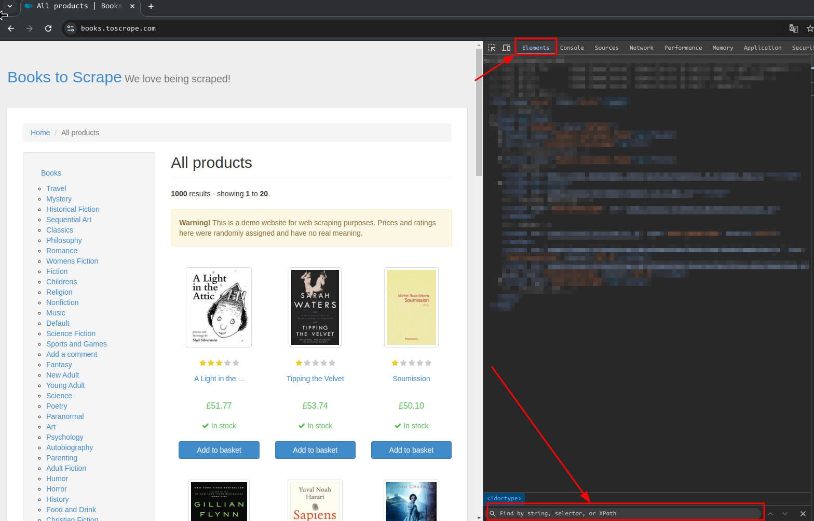


### select by tag name

```css
small
```

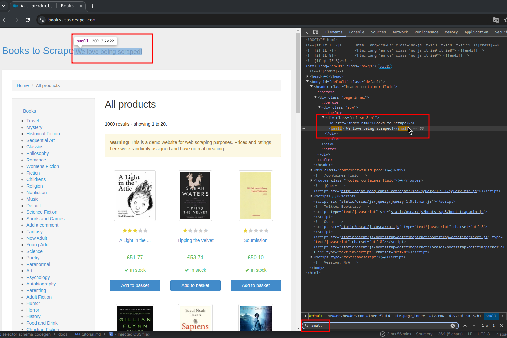

### select by class or id name

select all div tags with class="page_inner"

```css
div.page_inner
```

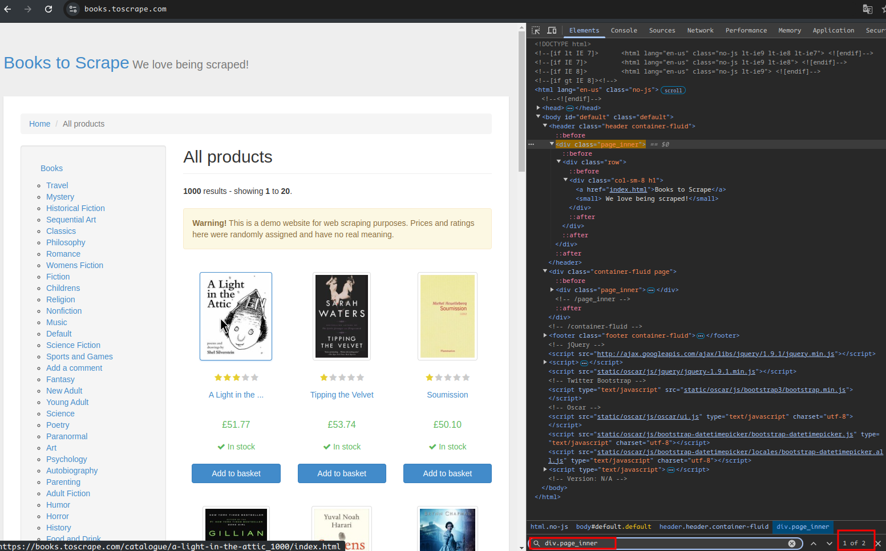

>[!tip]
> tag name is optional in CSS selectors
> you can select all tags with `.page_inner` class name
```css
.page_inner
```

select by tag id
```css
#default
```

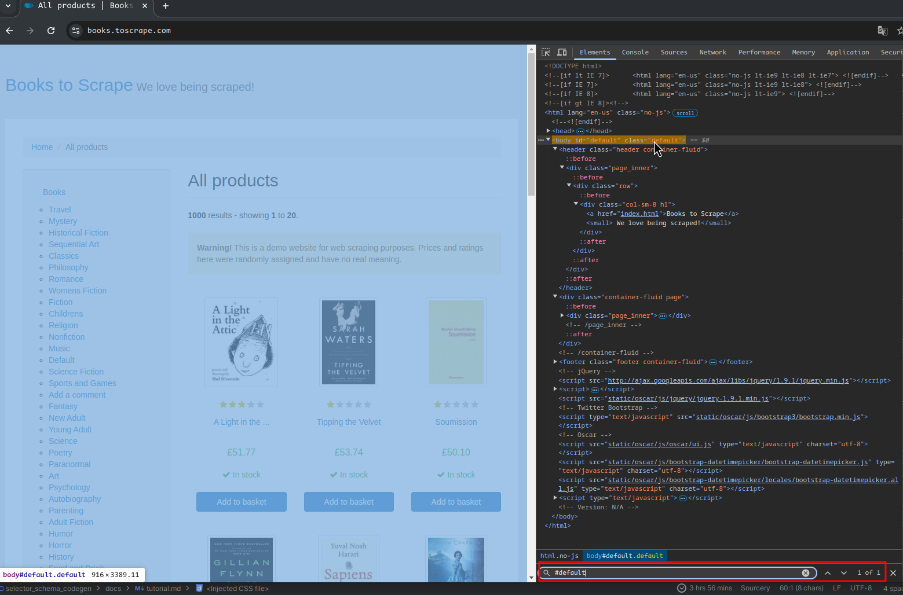

>[!tip]
> tag name is optional in CSS selectors
> you can select all tags with `#default` id
```css
body#default
```

### combined selectors

Get all `<a>` tag  inside a `.sidebar` class tag

```css
.sidebar a
```

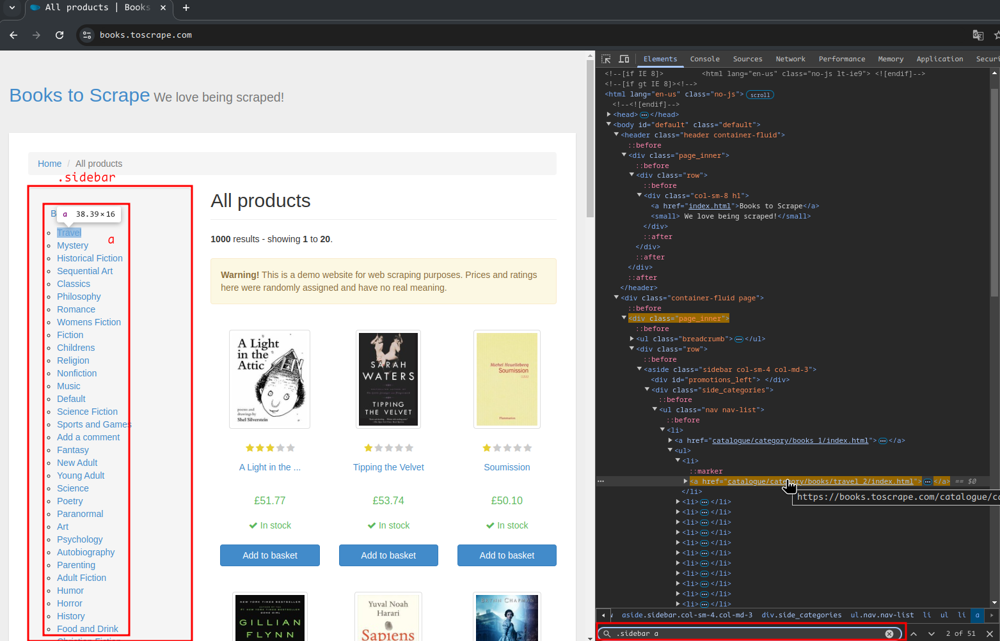

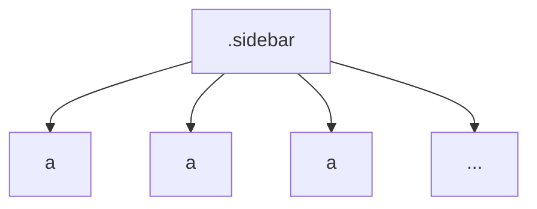

### find by attribute

find `<a>` tags with `href` attribute
```css
a[href]
```

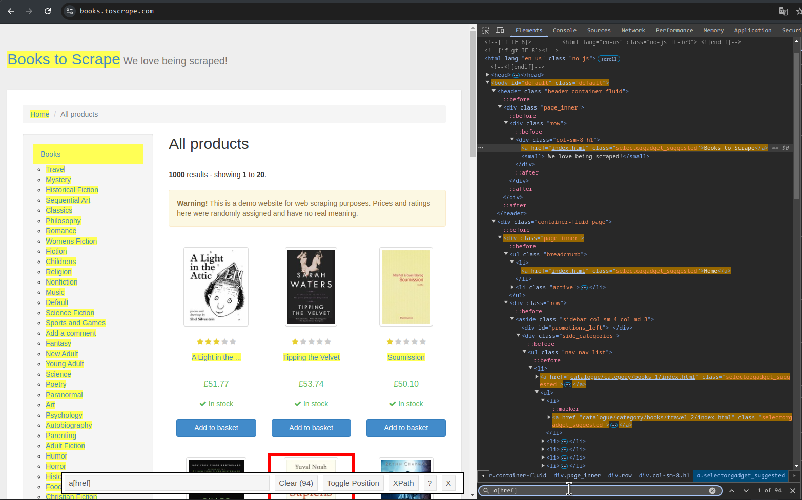

### child tags search

Find `<a>` tags where

- `<li>` tag parent
- `<ul>` tag parent for `<li>`

```css
ul > li > a
```

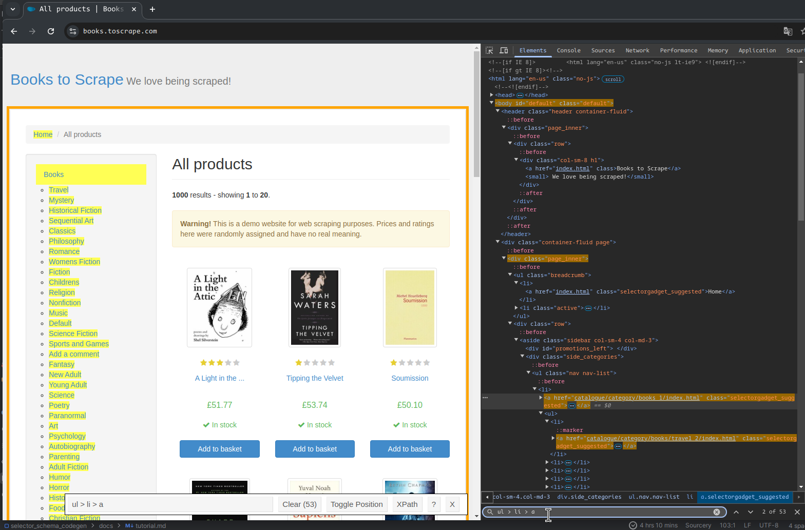

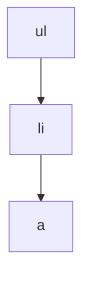

### parent tags search

find all <ul> tags where <a> tag is child

```css
a +ul
```

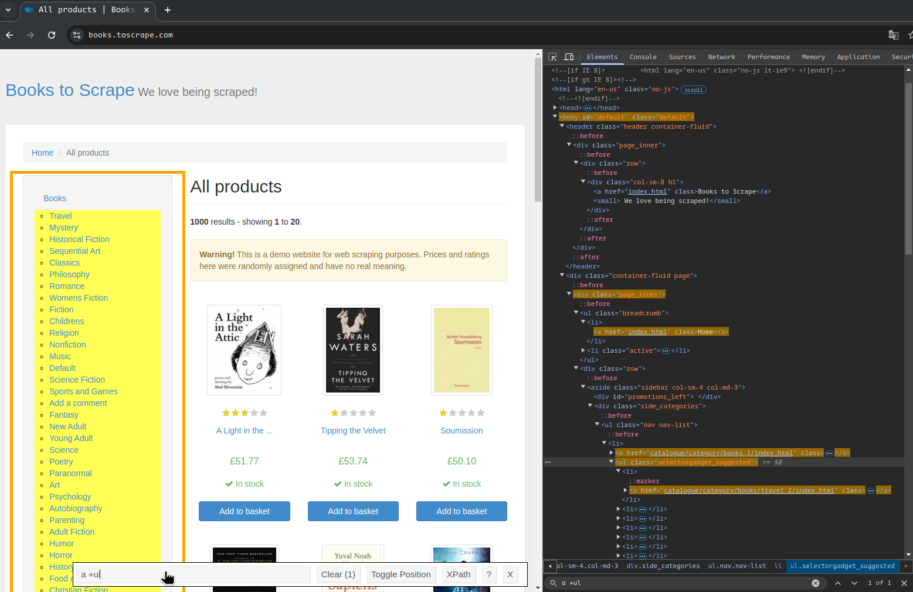

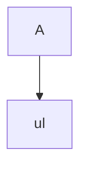

### pseudo classes


| selector               | description                                                      |
|------------------------|------------------------------------------------------------------|
| `ul > li:first-child`  | get first child element for `<ul>` tag                           |
| `ul > li:last-child`   | get last child element for `<ul>` tag                            |
| `ul > li:nth-child(5)` | get child element for `<ul>` tag by index. Index starts at `(1)` |


### useful plugin

For chromium-based browsers, use 
[selector-gadget](https://chromewebstore.google.com/detail/selectorgadget/mhjhnkcfbdhnjickkkdbjoemdmbfginb)
extension. it will make it easier to find the optimal css selectors


## regular expressions

>[!tip]
> There are plenty of regexp tutorials on the internet, find them yourself!

- [quickref.me](https://quickref.me/regex.html) - Another regex cheat sheet
- [regex101](https://regex101.com/) - interactive tester and debugger regexps

