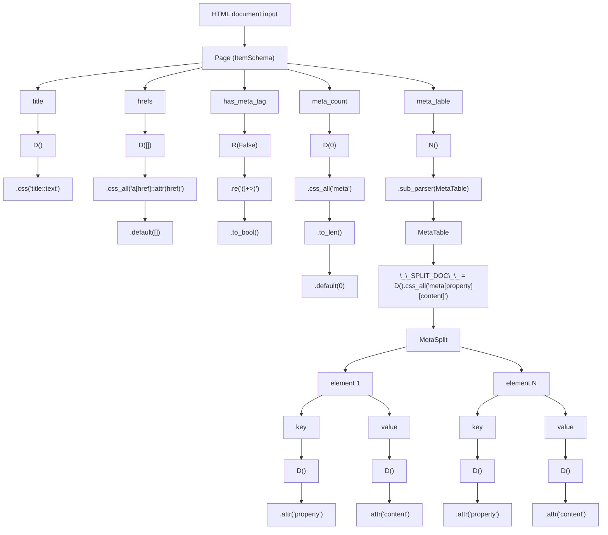

# Explain read configs

To read such configs quickly and correctly, you only need to understand two things:

* **CSS selectors** - to find the necessary elements in HTML
* **Regex** - to cut out pieces of text using a template.

---

## Idea

DSL is designed to **describe HTML parsers as briefly, clearly, and legibly** as if you were writing a **recipe**:
"Take all the links, get their `href`, count the `meta` tags, and transfer them to a table."

---

## High-level API

* **`D()`** - (Document)
  The main builder of expressions. Through a chain of calls, it determines ** what exactly and how to extract** from an HTML document or element.

* **`R()`** - alias `D().raw()`.
  It is used if you want to work with **raw text** (for example, to apply regular expression).

* **`N()`** - (Nested)
  Passes the current document or element to a **nested parser** (another class) to assemble a more complex data structure.

* **`__SPLIT_DOC__`**
  Specifies **how to split the document** into pieces before parsing.

* **`ItemSchema`**
  A schema class for describing **a single object**. Returns the result as a dictionary.

* **`ListSchema`**
  Schema class for **lists**. Divides the document using `__SPLIT_DOC__`, then parses each element.

* **Default values  `.default()`**
  In order for the parser to be stable and not fall off if something is missing in the HTML, you can set the default value.

>[!note]
> the default offset must **match the type** of what the expression returns (list, number, boolean, etc.).


* **docstrings**
  A feature has been added to transfer docstring to the code, as it may be important to describe which http endpoints to send requests to and how to prepare an HTML document and what errors may occur.


---

## Example

```python
from ssc_genfrom ssc_codegen import ItemSchema, ListSchema, D, R, N

class MetaItems(ListSchema):
    # find all elements <meta> with name AND property attributes
    __SPLIT_DOC__ = D().css_all("meta[name][property]")
    # send to next defined fields:

    # and parse this elements
    name = D().attr("name")
    property = D().attr("property")


# this docstring will be transferred to the generated code.
# recommended pass to docstring HOWTO prepare html document input
class Page(ItemSchema):
    """Demo scraper config

    USAGE:
        GET <any html document>
    """

    # shortcut pseudo selector ::text == .text()
    # alias: D().css("title").text()
    title = D().css("title::text")

    # shortcut default value init
    # !!! type must match the final result of the chain function execution.
    # alias: D().default([]).css_all("a[href]").attr("href")
    hrefs = D([]).css_all("a[href]::attr(href)")

    # work with raw string
    # to optimize the regular expression search for this example, 
    # it is best to extract part of the elements from the <head> element:
    # D(False).css("head::raw").re(r"(<meta[^>]+>)").to_bool()
    # D(False).css("head").raw().re(r"(<meta[^>]+>)").to_bool()
    # alias: D().default(False).raw().re(r"(<meta)").to_bool()
    has_meta_tag = R(False).re(r"(<meta[^>]+>)").to_bool()

    # cast to array lenght example
    # alias: D().default(0).css_all("meta").to_len()
    meta_count = D(0).css_all("meta").to_len()

    # send document object to `MetaTable` class and parse it
    meta_table = N().sub_parser(MetaTable)
```

visualization works



## Reccomendation implementation and read

1. Name the input structure by its name or prefix like `Main`, `Page`, if a large number of nested structures are assumed.
1. **Look at the class type** ('ItemSchema` or `ListSchema') - it tells you whether the result will be a list or an object.
2. **Each field = rule**: "what to get and how to process".
3. **D / R / N** markers:
   * D - standart extract data: 
      1. first selectors
      2. next string operations
      3. last - final cast to type (optional)
   * R - works with raw html document or element
   * N - passing a document or element to a sub-parser
4. **.default()** - **.default()** — "insurance": sets the default value so that the parser always returns the expected type.
5. **Shortcut-aliases** — show a simplified entry form.

## Other structures

These structures are placed in a separate section because they are situational in application.

The first two listed will be enough to cover most tasks.

### DictSchema

Generating a parser with a key with an arbitrary value

```python
class Meta(DictSchema):
    __SPLIT_DOC__ = D().css_all("meta[name][property]")

    # should be always as string
    __KEY__ = D().attr("name")

    # can be other types
    __VALUE__ = D().attr("property")
```

- It is necessary to declare `__SPLIT_DOC__`, `__KEY__`, `__VALUE__`
- `__KEY__` - must be a string
- `__VALUE__` - can be any type

### FlatListShema

The most unused data structure

```python
from ssc_codegen import DictSchema, D, FlatListSchema


# equivalent EXPR
# D([]).css_all("a[href]::attr(href)")
class AHrefs(FlatListSchema):
    __SPLIT_DOC__ = D().css_all("a[href]")

    __ITEM__ = D().attr("href")
```

### AccUniqueListSchema

A situational structure where unique values need to be accumulated from a series of data.

The order of the elements is not guaranteed.

```python
from ssc_codegen import AccUniqueListSchema, D


class GitUrlParser(AccUniqueListSchema):
    """Extract all public git links from page from

    """
    # provide default value as empty list for more stabe work
    # all fields should be a returns array of strings type

    # You can add additional attributes using the `,` combinator.
    github = D([]).css_all('[href*="github.com"], [src*="github.com"]')
    gitlab = D([]).css_all('a[href*="gitlab.com"]')
    codeberg = D([]).css_all('a[href*="codeberg.org"]')
    gittea = D([]).css_all('a[href*="gittea.dev"]')
    # add other links
```

--- 

Next, see the implementationы in examples