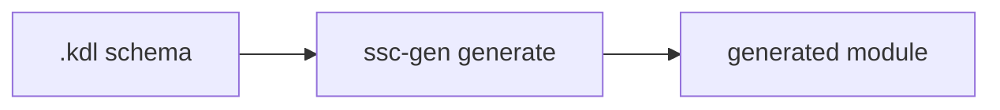

# 01. Генерация модулей: зачем и как

**Версия DSL:** 2.1  
**Последнее обновление:** 2026-04-07

Цель генерации — превратить `.kdl` схему в готовый модуль парсинга.

## Идея на простом примере

Классический парсер обычно выглядит так: много императивного кода, ручные
проверки, повторяющиеся шаги.

```python
# условный императивный стиль
title = soup.select_one("h1").text.strip()
price_text = soup.select_one(".price").text
price = float(re.search(r"(\d+\.\d+)", price_text)[1])
```

В KDL Schema DSL это описывается декларативно:

```kdl
struct Product {
    title { css "h1"; text; trim }
    price { css ".price"; text; re #"(\d+\.\d+)"#; to-float }
}
```

Схема — это **модуль**, который описывает:
- *что* извлечь (структуру данных);
- *как* извлечь (pipeline операций).

Генератор берет эту схему и создает готовый модуль парсинга на выбранном языке.

## Почему это удобнее

- Меньше ручного кода, меньше ошибок.
- Линтер ловит проблемы до запуска.
- Один и тот же DSL можно генерировать в разные языки/рантаймы.
- Генерируется максимально портируемый модуль, без привязки к кодовой базе и зависящий только от выбранной библиотеки парсинга.
- Схема легче поддерживается и читается как спецификация.

## Команда генерации

```bash
ssc-gen generate schema.kdl -t py-bs4
```



Ключевые параметры:
- `-t` — целевой backend (например `py-bs4`, `js-pure`).
- `-o` — куда записать результат (если не указано, пишет рядом).

## Что генерируется

В результате появляется модуль:
- с классами/функциями парсера;
- с типами результатов;
- с реализацией pipeline операций.

## Документируемость

Схема может содержать документацию, которая переносится в сгенерированный модуль.

```kdl
@doc """
Парсер карточек книг.
HTML источник: https://books.toscrape.com/
"""

struct MainCatalogue {
    @doc "Список карточек"
    books { nested Book }
}
```

Это удобно, когда нужно объяснить:
- откуда брать HTML;
- какие есть ограничения/особенности;
- как использовать парсер.

## Как быстро проверить схему

Можно сразу прогнать схему на HTML:

```bash
curl "https://books.toscrape.com" | ssc-gen run examples/booksToScrape.kdl:MainCatalogue
```

Можно быстро проверить валидность селекторов:

```bash
curl "https://books.toscrape.com" | ssc-gen health examples/booksToScrape.kdl:MainCatalogue
```
