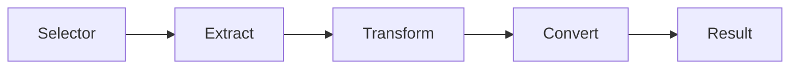

# 02. Описание полей и pipeline

**Версия DSL:** 2.1  
**Последнее обновление:** 2026-04-07

Поле — это набор операций, которые извлекают и преобразуют данные.

## Формы записи

В KDL2.0 `;` — это просто разделитель операций, чтобы не писать отступы.
Обе формы эквивалентны:

```kdl
title { css "h1"; text }
```

```kdl
title {
    css "h1"
    text
}
```

## Как читать pipeline

Обычно цепочка выглядит так:

```
Selector -> Extract -> Transform -> Convert -> Result
```



Пример:
- `css ".price"` находит элемент;
- `text` берет текст;
- `re` оставляет только число;
- `to-float` приводит к числу.

## Пример с реальным HTML

Источник: https://books.toscrape.com/

```kdl
struct Book type=list {
    @split-doc { css-all ".product_pod" }

    title { css "h3 a"; attr "title" }
    price { css ".price_color"; text; re #"(\d+\.\d+)"#; to-float }
}
```

## Ссылки на @init

`@init` позволяет посчитать значение один раз и использовать в полях:

Источник: https://quotes.toscrape.com/js/

```kdl
define JSON-PATTERN=#"""
(?xs)
    var\s+data\s*=\s*(\[.*\])
"""#

json Quote array=#true {
    text str
}

struct Main {
    @init {
        raw-json { raw; re JSON-PATTERN }
    }
    data { @raw-json; jsonify Quote }
}
```

Ссылки на `@init` пишутся как `@name`.

## Вложенные структуры

Источник: https://books.toscrape.com/

```kdl
struct Book type=list {
    @split-doc { css-all ".product_pod" }
    title { css "h3 a"; attr "title" }
}

struct Main {
    books { nested Book }
}
```

`nested` возвращает структуру, описанную отдельно.

## Типы структур — кратко

- `item` — один объект (по умолчанию).
- `list` — список объектов, требует `@split-doc`.
- `flat` — плоский список строк, дубли удаляются.
- `dict` — ключ/значение, требует `@split-doc`, `@key`, `@value`.
- `table` — парсинг таблиц, требует `@table`, `@rows`, `@match`, `@value`.

Полные примеры см. в [06-recipes.md](06-recipes.md).

## Поля таблиц (type=table)

В `type=table` поле начинается с `match { ... }`:

Источник: https://books.toscrape.com/catalogue/in-her-wake_980/index.html

```kdl
struct ProductInfo type=table {
    @table { css "table" }
    @rows { css-all "tr" }
    @match { css "th"; text; trim; lower }
    @value { css "td"; text }

    price {
        match { starts "price" }
        re #"(\d+\.\d+)"#
        to-float
    }
}
```


`match` выбирает строку таблицы, затем pipeline работает над значением из `@value`.
