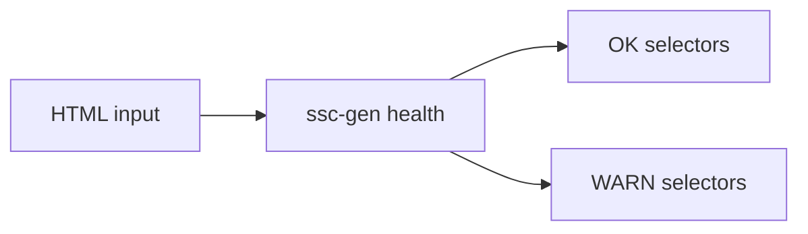

# 05. Проверка селекторов (`ssc-gen health`)

**Версия DSL:** 2.1  
**Последнее обновление:** 2026-04-07

`ssc-gen health` прогоняет селекторы по HTML и показывает, что находится.



## Пример

```bash
curl "https://books.toscrape.com" | ssc-gen health examples/booksToScrape.kdl:MainCatalogue
```

## Пример вывода

```
MainCatalogue: 8 selectors checked — 7 ok, 1 warnings
  MainCatalogue.prev-page               css      '.previous a'                             WARN  (0 matches, fallback=None)
  MainCatalogue.next-page               css      '.next a'                                 OK  (1 matches)
  MainCatalogue.curr-page               css      '.current'                                OK  (1 matches)
  MainCatalogue.books[Book].@split-doc  css-all  '.col-lg-3'                               OK  (20 matches)
  MainCatalogue.books[Book].name        css      '.thumbnail'                              OK  (20 matches)
  MainCatalogue.books[Book].image-url   css      '.thumbnail'                              OK  (20 matches)
  MainCatalogue.books[Book].rating      css      '.star-rating'                            OK  (20 matches)
  MainCatalogue.books[Book].price       css      '.price_color'                            OK  (20 matches)
```

## Как читать результат

- `OK` — селектор находит элементы.
- `WARN` — элементов нет. Проверь:
  - правильность селектора;
  - тип страницы (например, другая пагинация);
  - наличие `fallback`.
