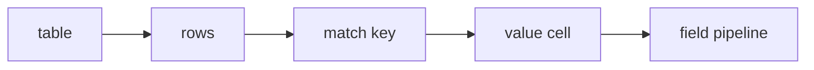

# 06. Рецепты

**Версия DSL:** 2.1  
**Последнее обновление:** 2026-04-07

Набор базовых шаблонов с реальными источниками HTML.

## 1. Один объект (type=item)

**Когда использовать:** самый частый случай. `type=item` — дефолт, можно не указывать.

Источник: https://books.toscrape.com/catalogue/in-her-wake_980/index.html

```kdl
struct ProductPage {
    title { css "h1"; text }
    price { css ".price_color"; text; re #"(\d+\.\d+)"#; to-float }
    availability { css ".availability"; text; normalize-space }
}
```

## 2. Список карточек (type=list)

**Когда использовать:** когда на странице много одинаковых карточек.

Источник: https://books.toscrape.com/

```kdl
struct Book type=list {
    @split-doc { css-all ".product_pod" }
    title { css "h3 a"; attr "title" }
    price { css ".price_color"; text; re #"(\d+\.\d+)"#; to-float }
    rating { css ".star-rating"; attr "class"; rm-prefix "star-rating " }
}
```

## 3. Плоский список строк (type=flat)

**Когда использовать:** когда нужен один плоский список уникальных строк.
`flat` собирает результаты всех полей с типом `STRING` или `LIST_STRING`,
удаляет дубли. Если важен порядок, используйте `keep-order=#true`.

Источник: страница с соцсетями в footer, например https://www.python.org/

```kdl
struct SocialLinks type=flat {
    @init {
        links { css-all "a[href]"; attr "href" }
    }
    twitter {
        @links
        filter { contains "twitter.com" "x.com" }
        fallback {}
    }
    github {
        @links
        filter { contains "github.com" }
        fallback {}
    }
    linkedin {
        @links
        filter { contains "linkedin.com" }
        fallback {}
    }
}
```

## 4. Key-value словарь (type=dict)

**Когда использовать:** когда на странице есть повторяющиеся пары ключ/значение.

Источник: https://books.toscrape.com/catalogue/in-her-wake_980/index.html

```kdl
struct MetaOG type=dict {
    @split-doc { css-all "meta[property^='og:']" }
    @key { attr "property"; rm-prefix "og:" }
    @value { attr "content" }
}
```

## 5. Таблица (type=table)

**Когда использовать:** когда данные лежат в `<table>` или таблице-подобной разметке.
Через `type=table` проще, чем через `type=list`, потому что `match` выбирает строку
по ключу, а не по индексу.

Источник: https://books.toscrape.com/catalogue/in-her-wake_980/index.html



```kdl
struct ProductInfo type=table {
    @table { css "table" }
    @rows { css-all "tr" }
    @match { css "th"; text; trim; lower }
    @value { css "td"; text }

    price {
        match { starts "price" }
        re #"(\d+\.\d+)"#
        to-float
    }
    upc {
        match { eq "upc" }
    }
}
```

## 6. Вложенные структуры

**Когда использовать:** когда часть страницы — самостоятельная структура.

Источник: https://books.toscrape.com/

```kdl
struct Book type=list {
    @split-doc { css-all ".product_pod" }
    title { css "h3 a"; attr "title" }
    price { css ".price_color"; text; re #"(\d+\.\d+)"#; to-float }
}

struct Main {
    books { nested Book }
}
```

## 7. JSON внутри HTML (`jsonify`)

**Когда использовать:** когда данные лежат в JSON внутри HTML/JS.

Источник: https://quotes.toscrape.com/js/

```kdl
define JSON-PATTERN=#"""
(?xs)
    var\s+data\s*=\s*(\[.*\])
"""#

json Quote array=#true {
    text str
    author str
}

struct Main {
    @init { raw-json { raw; re JSON-PATTERN } }
    quotes { @raw-json; jsonify Quote }
}
```

JSON может лежать и в атрибутах/свойствах:

```kdl
struct DataState {
    json {
        css "#app"
        attr "data-state"
        // Важно: jsonify не делает unescape автоматически.
        // Если JSON экранирован HTML-энтитями, добавьте unescape перед jsonify.
        unescape
        jsonify AppState
    }
}
```

### Alias ключей в JSON

Если ключ в JSON невалидный для имени поля, можно указать alias:

```kdl
json Schema {
    context str "@context"
}
```

Здесь `context` — имя поля в схеме, `@context` — реальный ключ в JSON.
