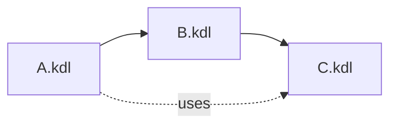

# 09. Imports

**Версия DSL:** 2.1  
**Последнее обновление:** 2026-04-07

`import` подключает определения из другого `.kdl` файла.

## Что импортируется

- `define` (скалярные и блочные)
- `transform`
- `dsl`
- `json`
- `struct`

Импорт транзитивный: если `A` импортирует `B`, а `B` импортирует `C`, то `A` видит `C`.



## Пример

`shared_defines.kdl`:

```kdl
define BASE-URL="https://example.com/{{}}"
define RE-PRICE=#"(\d+\.\d+)"#
```

`main.kdl`:

```kdl
import "./shared_defines.kdl"

struct Page {
    link { css "a"; attr "href"; fmt BASE-URL }
    price { css ".price"; text; re RE-PRICE; to-float }
}
```

## Селективный импорт

```kdl
import "./shared_defines.kdl" { BASE-URL }
```

## Ограничения

- Путь разрешается относительно текущего файла.
- Циклические импорты запрещены.
- Конфликты имен запрещены.
- Импорт работает только при парсинге из файла (нужен путь для резолва).
