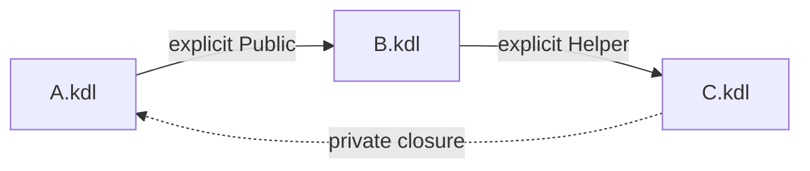

# 09. Imports

**Версия DSL:** 2.1  
**Последнее обновление:** 2026-08-24

`import` подключает явно перечисленные определения из другого `.kdl` файла.

## Что импортируется

- `define` (скалярные и блочные)
- `json`
- `struct`
- `fn`
- `extension`

Imports private: symbols не переэкспортируются автоматически. Dependency closure
выбранного symbol подключается для codegen, но caller видит только явно
перечисленные names.


```mermaid
graph LR
  A[A.kdl] -->|explicit Public| B[B.kdl]
  B -->|explicit Helper| C[C.kdl]
  C -. private closure .-> A
```

## Пример

`shared_defines.kdl`:

```kdl
define BASE-URL="https://example.com/{{}}"
define RE-PRICE=#"(\d+\.\d+)"#
```

`main.kdl`:

```kdl
import "./shared_defines.kdl" {
    (define)BASE-URL
    (define)RE-PRICE
}

struct Page {
    link { css "a"; attr "href"; fmt BASE-URL }
    price { css ".price"; text; re RE-PRICE; to-float }
}
```

## Обязательная типизация

```kdl
import "./shared.kdl" {
    (extension)Utils
    (struct)Book
    (json)Response
    (define)BASE-URL
    (fn)parse-title
}
```

## Ограничения

- Путь разрешается относительно текущего файла.
- Непустой block обязателен; import-all отсутствует.
- Bare symbols без `(kind)` запрещены.
- Циклические импорты запрещены.
- Конфликты имен запрещены.
- Импортировать можно только local declarations указанного файла, не его imports.
- Импорт работает только при парсинге из файла (нужен путь для резолва).
