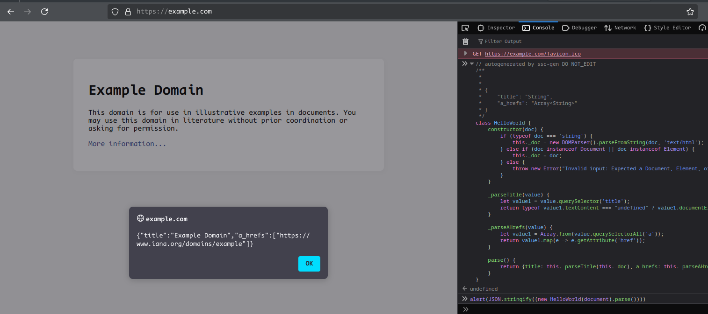

# Quickstart

## Create file with name `schema.py` and add next code:

```python
from ssc_codegen import ItemSchema, D

class HelloWorld(ItemSchema):
    title = D().css('title').text()
    a_hrefs = D().css_all('a').attr('href')
```

## CLI test config 

>[!note]
> this tools developed for testing purposes, not for web-scraping tasks

## File

> helloWorld.html
```html
<!DOCTYPE html>
<html lang="en">
<head>
    <title>Hello, world!</title>
</head>
<body></body>
</html>
```

```shell
ssc-gen parse-from-file helloWorld.html -t schema.py:HelloWorld  
```

- `-t --target` - config schema file and run class entrypoint


## Simple http request

```shell
ssc-gen parse-from-url https://example.com -t schema.py:HelloWorld  
```


## Chrome browser (CDP protocol)

```shell
ssc-gen parse-from-chrome https://example.com -t schema.py:HelloWorld
```

>[!note]
> if script cannot found chrome executable - provide it manually:

```shell
ssc-gen parse-from-chrome https://example.com -t schema.py:HelloWorld -sc /usr/bin/chromium
```
## or generate to code

generated code looks like this:

```shell
ssc-gen js schema.py -o .
```

```js
// autogenerated by ssc-gen DO NOT_EDIT
/***
 *
 * {
 *     "title": "String",
 *     "a_hrefs": "Array<String>"
 * }*/
class HelloWorld {

    constructor(doc) {
        if (typeof doc === 'string') {
            this._doc = new DOMParser().parseFromString(doc, 'text/html');
        } else if (doc instanceof Document || doc instanceof Element) {
            this._doc = doc;
        } else {
            throw new Error("Invalid input: Expected a Document, Element, or string");
        }
    }

    _parseTitle(v) {
        let v0 = v.querySelector('title');
        return typeof v0.textContent === "undefined" ? v0.documentElement.textContent : v0.textContent;
    }

    _parseAHrefs(v) {
        let v0 = Array.from(v.querySelectorAll('a'));
        return v0.map(e => e.getAttribute('href'));
    }

    parse() {
        return {
            title: this._parseTitle(this._doc),
            a_hrefs: this._parseAHrefs(this._doc),
        };
    }
}
```

Copy code output and past next code to developer console:

```javascript
alert(JSON.stringify((new HelloWorld(document).parse())))
```


