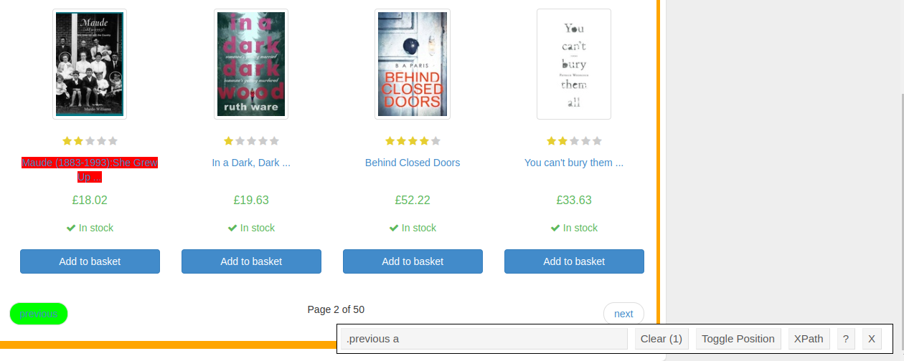
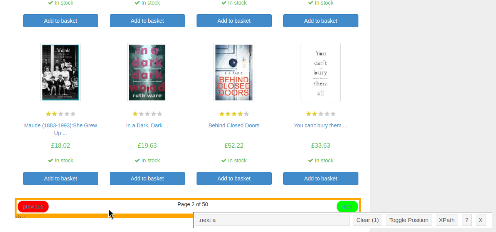
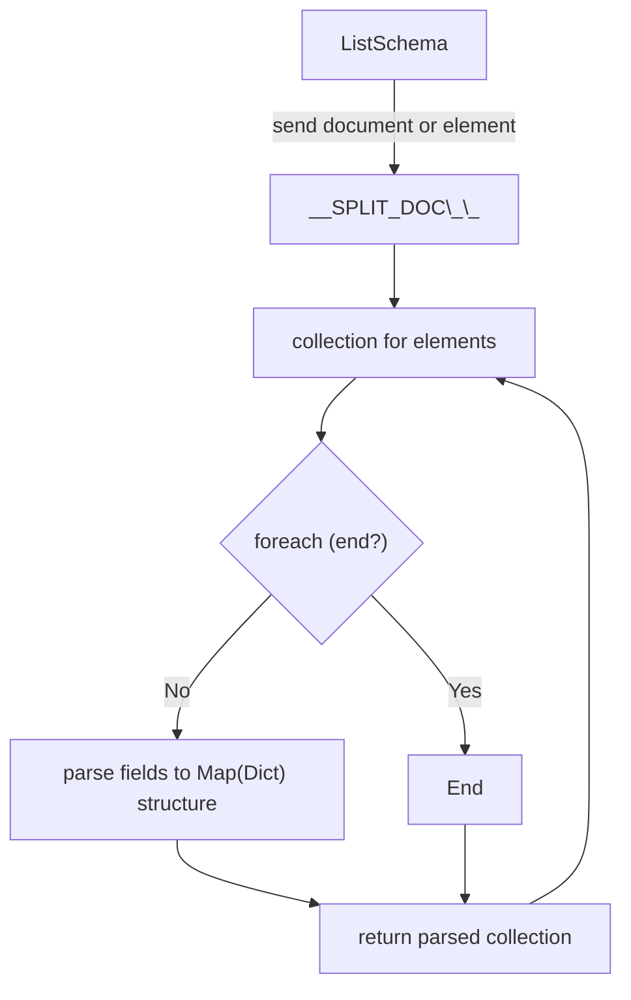
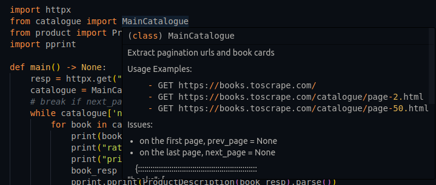
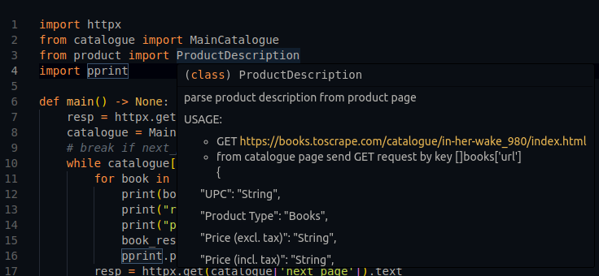
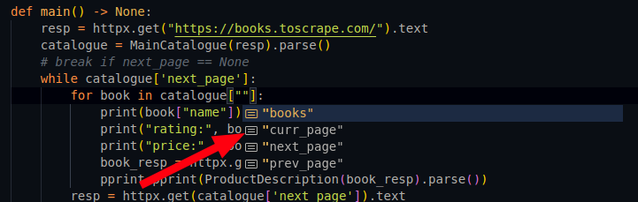
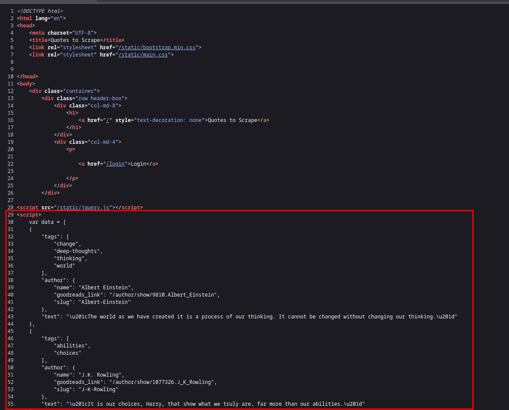

# Tutorial

## booksToScrape

Write web scraper for fictional bookstore https://books.toscrape.com/

### ItemSchema class. Extract pagination urls

#### Prepare

Go to the second page (https://books.toscrape.com/catalogue/page-2.html) and scroll to the end.



```html
<li class="previous"><a href="page-1.html">previous</a></li>
```



```html
<li class="next"><a href="page-3.html">next</a></li>
```

The first step for build schema parser - import and extent `ItemSchema` class and add fields.

This example extracts the pagination fields:

>[!tip]
> For output generated code you can mark parsers entrypoints with `Main` prefix

```python
# examples/tutorial/booksToScrape/schema1.py
from ssc_codegen import ItemSchema, D

class MainCatalogue(ItemSchema):
    # in start pagination not exists this tag, set None
    prev_page = D().default(None).css('.previous a').attr('href')
    # in end pagination not exists this tag, set None
    next_page = D().default(None).css('.next a').attr('href')
```

The action steps for every field extraction are described by a chain of expression calls:

- `default` - special expression: if the code block for field throw an error, set the default value.
In this case, there may be missing elements at the start (..page-1.html) and end of pagination (..page-50.html)
- `css` - CSS selector
- `attr` - extract value from element by attribute 


Run code via shell:

>[!note]
> in real projects, recommended download a real html page for local testing code


```shell
# from file
ssc-gen parse-from-url "https://books.toscrape.com/catalogue/page-2.html" -t schema1.py:MainCatalogue
#{
#  "prev_page": "page-1.html",
#  "next_page": "page-3.html"
#}
ssc-gen parse-from-url "https://books.toscrape.com" -t schema1.py:MainCatalogue
#{
#  "prev_page": null,
#  "next_page": "catalogue/page-2.html"
#}
```

Cool, its work! Add current page field and format pagination paths to full url

```python
# examples/tutorial/booksToScrape/schema2.py
from ssc_codegen import ItemSchema, D

FMT_URL = "https://books.toscrape.com/catalogue/{{}}"
FMT_URL_CURRENT = "https://books.toscrape.com/catalogue/page-{{}}.html"

class MainCatalogue(ItemSchema):
    # steps:
    # 1. set default if teg will be not founded
    # 2. get tag by css query
    # 3. get [href] attribute
    # 4. ltrim remove left substring
    # 5. fmt - format previous string by passed template
    prev_page = D().default(None).css('.previous a').attr('href').ltrim('catalogue/').fmt(FMT_URL)
    next_page = D().default(None).css('.next a').attr('href').ltrim('catalogue/').fmt(FMT_URL)
    # 1. get tag by .current class
    # 2. extract text and get current page number by regex
    # 3. insert result to template
    curr_page = D().css('.current').text().re(r'Page\s(\d+)').fmt(FMT_URL_CURRENT)
```

Test again:

```shell
ssc-gen parse-from-url "https://books.toscrape.com/catalogue/page-2.html" -t schema2.py:MainCatalogue
#{
#  "prev_page": "https://books.toscrape.com/catalogue/page-1.html",
#  "next_page": "https://books.toscrape.com/catalogue/page-3.html",
#  "curr_page": "https://books.toscrape.com/catalogue/page-2.html"
#}
```

### ListSchema class. Nested schemas. Extract product cards

The usual situation: convert duplicate elements into a separate and understandable data structure.
In the fictitious bookstore example, product cards are presented.

Inspect a single card element:

```html
<li class="col-xs-6 col-sm-4 col-md-3 col-lg-3">
    <article class="product_pod">
            <div class="image_container">
                    <a href="you-cant-bury-them-all-poems_961/index.html" class="">
                        </a>
            </div>
                <p class="star-rating Two">
                    <i class="icon-star"></i>
                    <i class="icon-star"></i>
                    <i class="icon-star"></i>
                    <i class="icon-star"></i>
                    <i class="icon-star"></i>
                </p>
            <h3><a href="you-cant-bury-them-all-poems_961/index.html" title="You can't bury them all: Poems" class="">You can't bury them ...</a></h3>
            <div class="product_price">
        <p class="price_color">£33.63</p>
<p class="instock availability">
    <i class="icon-ok"></i>
        In stock
</p>
    <form>
        <button type="submit" class="btn btn-primary btn-block" data-loading-text="Adding...">Add to basket</button>
    </form>
            </div>
    </article>
</li>
```

Potentially useful information for extraction:
- product name (in title attr): 
  - `<a href="you-cant-bury-them-all-poems_961/index.html" title="You can't bury them all: Poems" class="">`
- image 
  - ``
- product url 
  - `<a href="you-cant-bury-them-all-poems_961/index.html" class="">`
- rating (second class attribute)
  - `<p class="star-rating Two">`
- price 
  - `<p class="price_color">£33.63</p>`


Extend schema fields by this information:

```python
# examples/tutorial/booksToScrape/schema3.py
from ssc_codegen import ItemSchema, D, ListSchema, N

FMT_URL = "https://books.toscrape.com/catalogue/{{}}"
FMT_URL_CURRENT = "https://books.toscrape.com/catalogue/page-{{}}.html"
FMT_THUMBNAIL_BOOK = "https://books.toscrape.com{{}}"

class Book(ListSchema):
    __SPLIT_DOC__ = D().css_all(".col-lg-3")

    name = D().css(".thumbnail").attr("alt")
    image_url = D().css(".thumbnail").attr("src").ltrim('..').fmt(FMT_THUMBNAIL_BOOK)
    url = D().css(".image_container > a").attr("href").fmt(FMT_URL)
    rating = D().css(".star-rating").attr("class").ltrim("star-rating ")
    # convert price to integer
    price = D().default(0).css(".price_color").text().re(r"(\d+)").to_int()


class MainCatalogue(ItemSchema):
    # docstring is optional feature:
    # converter translate to output code
    # this will later help explain how to use this code
    """parse main catalogue page

    Response input examples:
        - https://books.toscrape.com/
        - https://books.toscrape.com/catalogue/page-2.html

    """
    books = N().sub_parser(Book)

    prev_page = D().default(None).css('.previous a').attr('href').ltrim('catalogue/').fmt(FMT_URL)
    next_page = D().default(None).css('.next a').attr('href').ltrim('catalogue/').fmt(FMT_URL)
    curr_page = D().css('.current').text().re(r'Page\s(\d+)').fmt(FMT_URL_CURRENT)
```

- `__SPLIT_DOC__` - special magic method: define how need part document or element input before parse.
should be ends as `css_all` or `xpath_all`. In current case - part document to list of product cards.
- `N()` - special alias for define nested structures. Useful for separating code and fields into logical structures.
- docstring feature will be demonstrated in [convert-to-code](#convert-to-code) section.


how to work ListSchema in scheme view:



Test updated code:

```shell
ssc-gen parse-from-url "https://books.toscrape.com/catalogue/page-2.html" -t schema3.py:MainCatalogue
# ...
#    {
#      "name": "You can't bury them all: Poems",
#      "image_url": "https://books.toscrape.com/media/cache/e9/20/e9203b733126c4a0832a1c7885dc27cf.jpg",
#      "url": "https://books.toscrape.com/catalogue/you-cant-bury-them-all-poems_961/index.html",
#      "rating": "Two",
#      "price": 33
#    }
#  ],
#  "prev_page": "https://books.toscrape.com/catalogue/page-1.html",
#  "next_page": "https://books.toscrape.com/catalogue/page-3.html",
#  "curr_page": "https://books.toscrape.com/catalogue/page-2.html"
#}
```

Also, you can pass `Book` class to `-t` option: its accept full document:

```shell
ssc-gen parse-from-url "https://books.toscrape.com/catalogue/page-2.html" -t schema3.py:Book
# [
#  {
#    "name": "In Her Wake",
#    "image_url": "https://books.toscrape.com/media/cache/5d/72/5d72709c6a7a9584a4d1cf07648bfce1.jpg",
#    "url": "https://books.toscrape.com/catalogue/in-her-wake_980/index.html",
#    "rating": "One",
#    "price": 12
#  }, 
#  ... 
#  ]
```


### DictSchema class. Parse product page

Another data structure - DictSchema.

It can be useful in the following situations:

- Parsing html tags of tables `<table> <tr> <tr> <th> <td>`
- When there is an unknown, unique key in the html (e.g., in attributes)

```html
<table class="table table-striped">
        <tr>
            <th>UPC</th><td>23356462d1320d61</td>
        </tr>
        <tr>
            <th>Product Type</th><td>Books</td>
        </tr>
            <tr>
                <th>Price (excl. tax)</th><td>£12.84</td>
            </tr>
                <tr>
                    <th>Price (incl. tax)</th><td>£12.84</td>
                </tr>
                <tr>
                    <th>Tax</th><td>£0.00</td>
                </tr>
            <tr>
                <th>Availability</th>
                <td>In stock (19 available)</td>
            </tr>
            <tr>
                <th>Number of reviews</th>
                <td>0</td>
            </tr>
    </table>
```

Write parser:

```python
# examples/tutorial/booksToScrape/schema4.py
from ssc_codegen import DictSchema, D


class ProductDescription(DictSchema):
    """parse product description from product page

    Response input examples:
        - https://books.toscrape.com/catalogue/in-her-wake_980/index.html
        - from catalogue page
    """
    __SPLIT_DOC__ = D().css_all("table tr")
    __SIGNATURE__ = {
        "UPC": "String",
        "Product Type": "Books",
        "Price (excl. tax)": "String",
        "Price (incl. tax)": "String",
        "Tax": "String",
        "Availability": "In stock (<count>)",
        "Number of reviews": "0 (always, its fiction shop lol)"
    }

    __KEY__ = D().css('th').text()
    __VALUE__ = D().css("td").text()
    # other defined fields do not be compiled and throw warning:
    # im_not_be_compiled = D().css("title").text()
```

- `__SPLIT_DOC__` - same as [ListSchema](#listschema-class-nested-schemas-extract-product-cards): 
split document or element to parts
- `__SIGNATURE__` - optional magic method: override fields information in docstring class
  - accept types: `str, int, float, None, list, dict`
  - in DictSchema, FlatListSchema signature is generated less informatively 
- `__KEY__` - special magic method: define how to parse key for pair a key-value. **Always should be a string**
- `__VALUE__` - special magic method: define how to parse value for pair a key-value

Run it!

```shell
ssc-gen parse-from-url "https://books.toscrape.com/catalogue/in-her-wake_980/index.html" -t schema4.py:ProductDescription
#{
#  "UPC": "23356462d1320d61",
#  "Product Type": "Books",
#  "Price (excl. tax)": "\u00a312.84",
#  "Price (incl. tax)": "\u00a312.84",
#  "Tax": "\u00a30.00",
#  "Availability": "In stock (19 available)",
#  "Number of reviews": "0"
#}
```

### Convert to code. Write a simple project

Schemes are defined, they do work, let's write a project!

>[!note]
> for example, will be compiled to [parsel](https://pypi.org/project/parsel/), you can try use another implemented
> converter. for prettify python code output [ruff](https://pypi.org/project/ruff/) required 

Compile:

```shell
# examples/tutorial
ssc-gen py booksToScrape/schema3.py booksToScrape/schema4.py -i parsel -o . 
```

Remember about docstring and `__SIGNATURE__` features? In IDE, it looks like this:




Types for parsed structures generated too:




Full project code example:

```python
# examples/tutorial/main.py
import httpx
from schema3 import MainCatalogue
from schema4 import ProductDescription
import pprint

def main() -> None:
    resp = httpx.get("https://books.toscrape.com/").text
    catalogue = MainCatalogue(resp).parse()
    # break if next_page == None
    while catalogue['next_page']:
        for book in catalogue["books"]:
            print(book["name"])
            book_resp = httpx.get(book["url"]).text
            pprint.pprint(ProductDescription(book_resp).parse())
        resp = httpx.get(catalogue['next_page']).text
        catalogue = MainCatalogue(resp).parse()


if __name__ == '__main__':
    main()
```

## quotesToScrapeJs. Parse JSON

Some sites with [server-side render](https://en.wikipedia.org/wiki/Server-side_scripting) can store json data
in html documents.
In order not to agonize with regular expressions, json parser functionality was added

Let's take an example https://quotes.toscrape.com/js/



1. Generate json parse template

You can manually write or automatically create a code template from the original json:

```shell
ssc-gen json-gen quotesToScrapeJs/jsn.json -o jsontemp.py
```

json-gen accepts STDIN:

```shell
echo '{"a": ["b", "c"]}' | ssc-gen json-gen -o tmp.py
```

Config example:

```python
# examples/tutorial/quotesToScrapeJs/quotesToScrapeJs.py
from ssc_codegen import Json, R, ItemSchema


class Author(Json):
    name: str
    goodreads_links: str
    slug: str


class Quote(Json):
    # mark as array entrypoint
    # if object (map/dict) contains in document - do not add it
    __IS_ARRAY__ = True

    tags: list[str]
    author: Author
    text: str


class Main(ItemSchema):
    # most difficult step:
    # write correct regular expression for extract a valid json structure
    data = R().re(r'var\s+\w+\s*=\s*(\[[\s\S]*?\]);').jsonify(Quote)
```

Test it!

```shell
ssc-gen parse-from-url "https://quotes.toscrape.com/js/" -t quotesToScrapeJs.py:Main
#{
#  "data": [
#    {
#      "tags": [
#        "change",
#        "deep-thoughts",
#        "thinking",
#        "world"
#      ],
#      "author": {
#        "name": "Albert Einstein",
#        "goodreads_link": "/author/show/9810.Albert_Einstein",
#        "slug": "Albert-Einstein"
#      },
#      "text": "\u201cThe world as we have created it is a process of our thinking. It cannot be changed without changing our thinking.\u201d"
#    },
# ... ]
```

- `R()` alias of `D().raw()`
- `.jsonify()` - json marshall operation
- `Json` - special struct for serialize json input
- `__IS_ARRAY__` - Json marks that the input point is an array with dictionaries

Full json mark types support:

| python type   | json type       |
|---------------|-----------------|
| str           | String          |
| int           | Integer         |
| float         | Float           |
| None          | null            |
| str \| None   | String \| null  |
| int \| None   | Integer \| null |
| float \| None | Float \| null   |
| Json          | Map (dict)      |
| list\[str]    | Array<String>   |
| list\[int]    | Array<Integer>  |
| list\[float]  | Array<Float>    |
| list\[Json]   | Array<Map>      |

### Json limitations

- keys always should be a string
- keys should matched by `[_a-zA-Z][_a-zA-Z0-9]*` and do not allowed target language keywords and other chars
- cannot modify keys, values in jsonify step
- json structure must be consistent. 
  - not allowed describe an array with random data types 
  - not allowed dictionaries with random keys